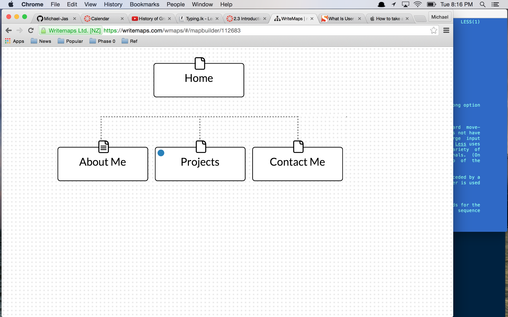

##What are the 6 Phases of Web Design?
1-Info Gathering:Purpose/goals/Taget Audience/ Content. 2-Planning: Site Maps (topics/sub-topics). 3-Design:What will the site look like. 4-Development:building the proto type. 5-Testing/Delivery: the finished product and functionality. 6-Maintence:general up keep of the site, either by CMS content mgmt system or the designer.
##What is your site's primary goal or purpose? What kind of content will your site feature?
The main objective of the site is to be my professional portfolio. On the site I plan on having  three main folders: About Me/Goal, My Projects, along with my Contact information. In these folders I will have links to social media, pictures, my personal blog, and a resume.

##What is your target audience's interests and how do you see your site addressing them?
The ideal target audience interests are employers looking for new developers and peer collaborators looking for additional resources and inspiration.  I see the site addressing them as snap shot of who I am and what I want to do as a developer.

##What is the primary "action" the user should take when coming to your site? Do you want them to search for information, contact you, or see your portfolio? It's ok to have several actions at once, or different actions for different kinds of visitors.
 The primary action would be to see my career goals, look over my project, and try to contact me/work with me.

##What are the main things someone should know about design and user experience?
One of the more interesting facts was at the beginning of design(like what I did there?) and users experience really did not go together. Companies needed a website and they would hire designers to create that  website. These companies really did not know enough websites, so the relied on the designer would they(the designer) thought looked good. Fast forward to modern day(a decade or two) where the design and user experience with make or break the website. They are so intwined that it is almost impossible to describe them without each other. Design and UX revolve around problem solving to make the most ideal websites.

##What is user experience design and why is it valuable?
The user experience design is all about how the person feels while they are interacting with a system. Also the UEX helps you asses what the users needs, anything from the layout to systems for the blind.

##Which parts of the challenge did you find tedious?

The Tedious part of this challenge  might be the last two question. They are very similar  and I’m not sure if my answer is sufficient enough. Also I had the Inline syntax correct for over two hours, but i could not get the picture to display on a new tab in the browser. But after those two hours I figured that out that I did not need to do that, I just had to push it to git. HELLO RABBIT HOLE!