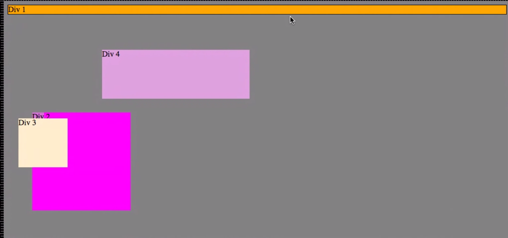
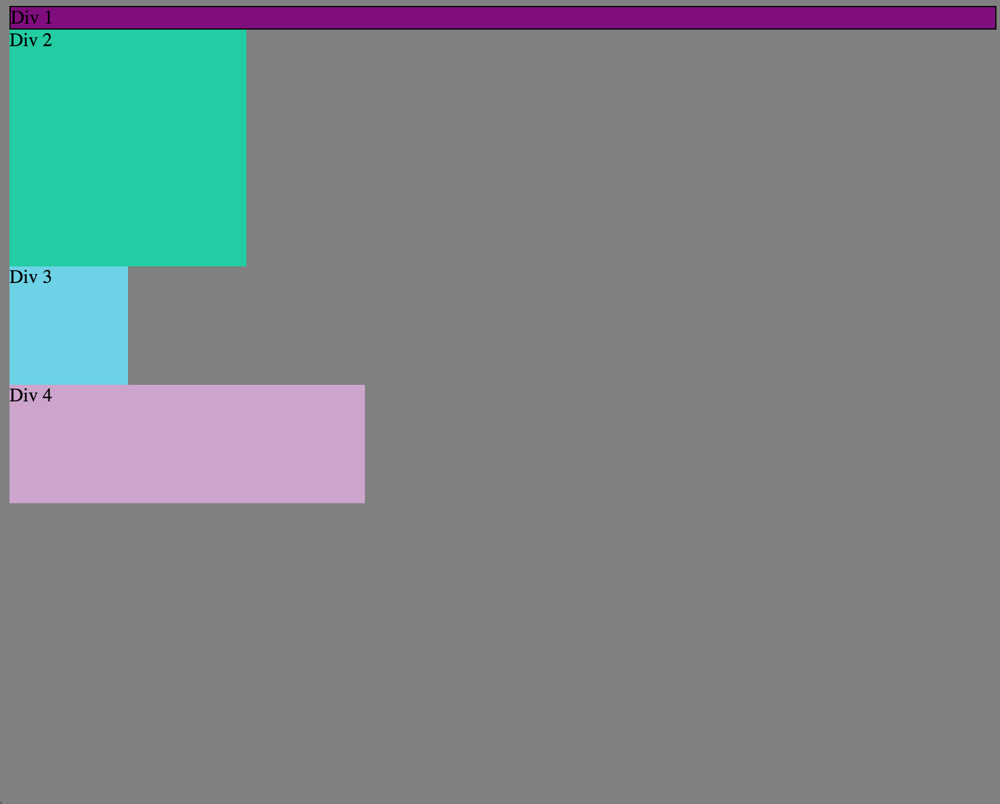
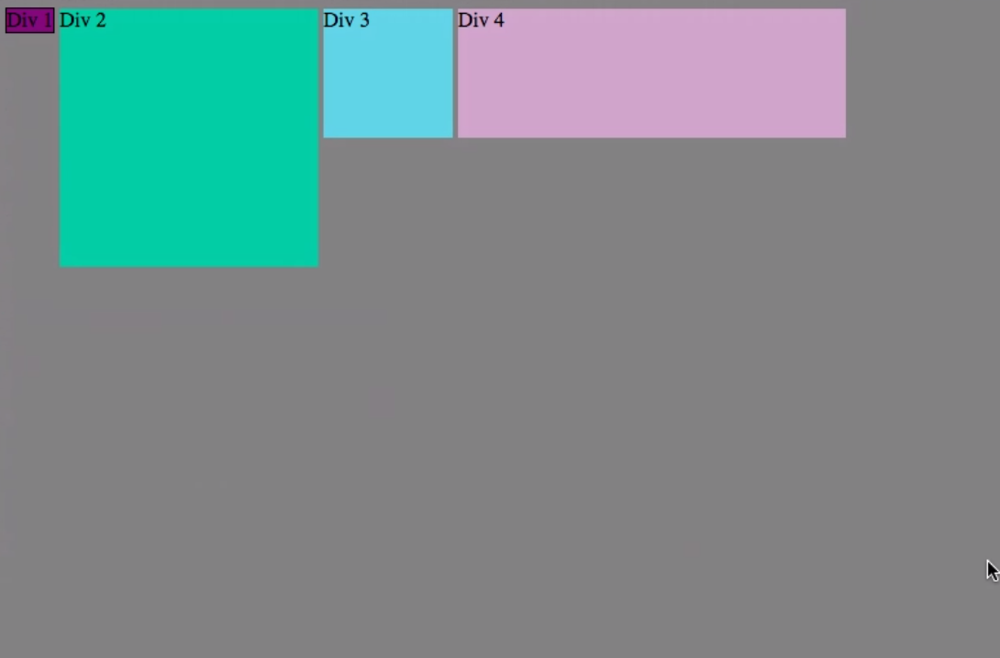
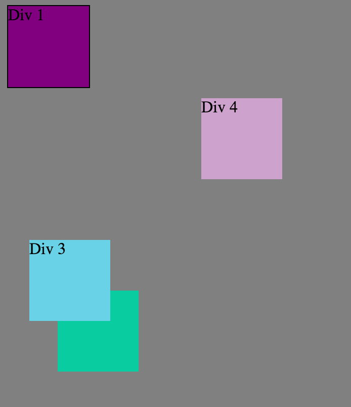
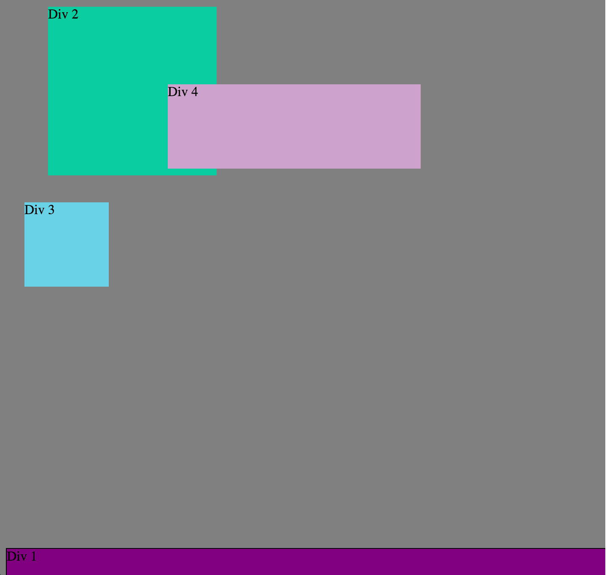
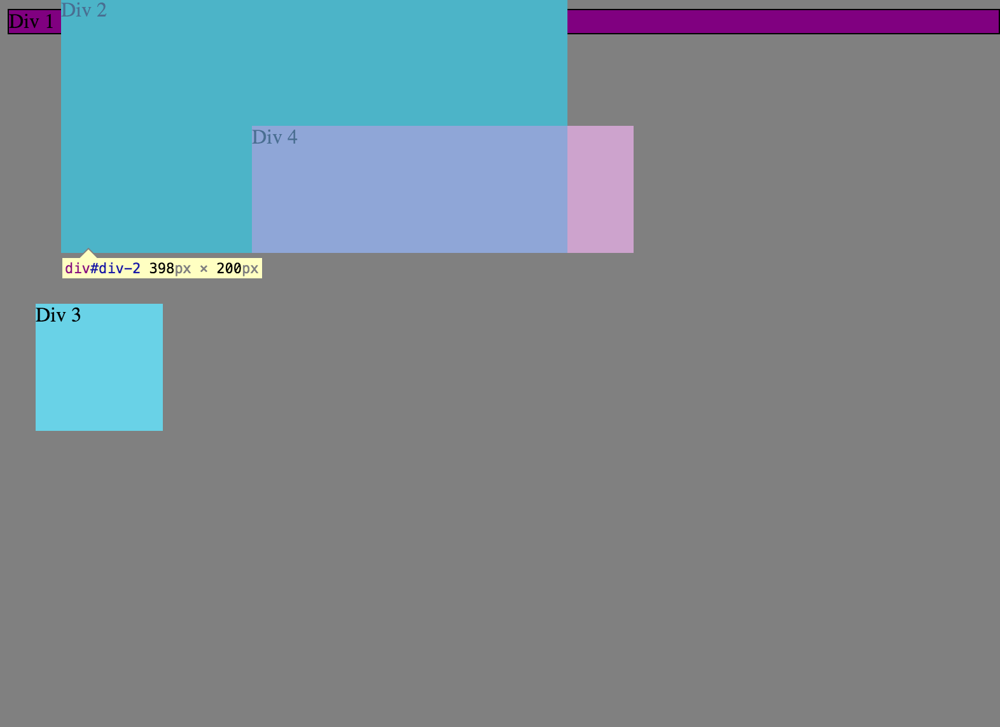
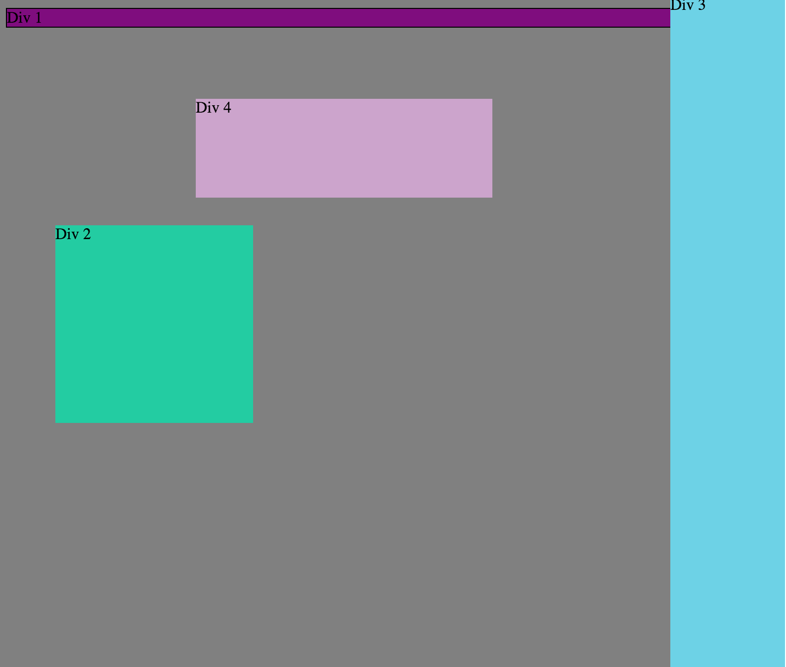
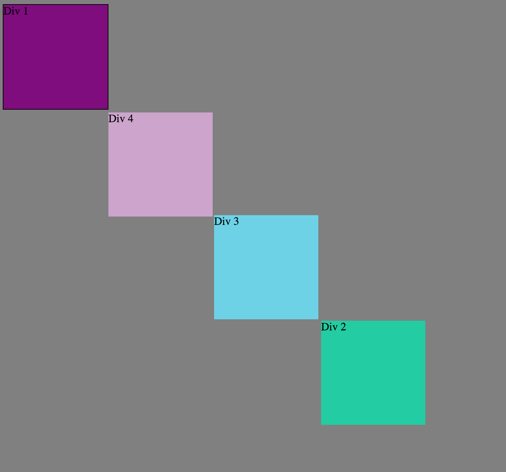

###How can you use Chrome's DevTools inspector to help you format or position elements?
 I think of DevTools as the Cinderella tool for Programming. Chrome DevTools is much like Cinderella because you can tell exactly what to do and there is zero repercussions to your final project(Becoming the princess). Cinderella(DevTools) allows you to play with the code and see what is chnaged in real time, instead of switching back and forth from sublime. Also you can test out the positioning so exactly that you will save valuable time and much needed sanity.

###How can you resize elements on the DOM using CSS?
You can edit and select the descriptors that influence the layout of elements. You can do this after selecting which html elment you want to reszie in the tree or sitemap.

###What are the differences between Absolute, Fixed, Static, and Relative positioning? Which did you find easiest to use? Which was most difficult?
-Static elements act on there own and land where the normally would land in the page(no real positioning).
-Relative: will be positioned where it normally would be put and will not be adjusted to fit anywhere.
-Absolute: positioned in relation to the the first parent element.
-Fixed: is stuck to the the position it lands, no matter what the does not more(its glued there).
 I really don't understand these at all. Everything I read is very abstract and I can not find a very direct approach.
###What are the differences between Margin, Border, and Padding?
Margin: is the space around the element as a whole. Border: is the edge of that element or the barrier wall keeping the content in. Padding is the gap/space between the element(content)  and the border.

###What was your impression of this challenge overall? (love, hate, and why?)
I love the Chrome DevTools after I figured out how to move all the contents on accident. Around the 4th img the project got harder to place the elements, and two later we figured out how to move the elements. We could have changed the ones that did not look good, but I wanted to show the progess that happen.As I stated before I really need help with the Ideas of Positioning. this is going to save me a great deal of time and it is cool.