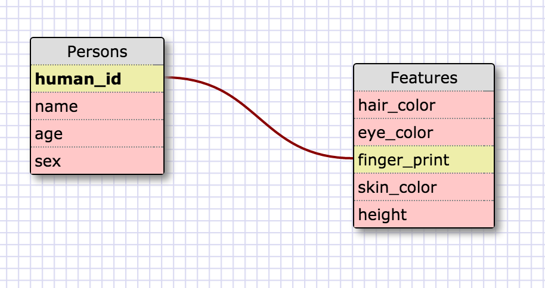

###What is a one-to-one database?
  This is when two things have one relation to each other, they are a pair.
###When would you use a one-to-one database? (Think generally, not in terms of the example you created).
  As twisted as this sounds I think a good example of this is the Federal Criminal System. Using finger prints
  to connect an individual to a crime. Many people can take part in a crime(I hope not) but each person will have
  their own finger print.
###What is a many-to-many database?
  When the Parent row could have more then one child row in a different table.

###When would you use a many-to-many database? (Think generally, not in terms of the example you created).
  You could use a many to many for architects as one table and a table for the designs/builds.

###What is confusing about database schemas? What makes sense?
  I understand the concepts, I think I am having issues with creating my own that fit the exact specifications
  to be one our the other. I might be stuck on the id also, because the schema board is throwing me off with
  what they are making the primary key and foreign key.